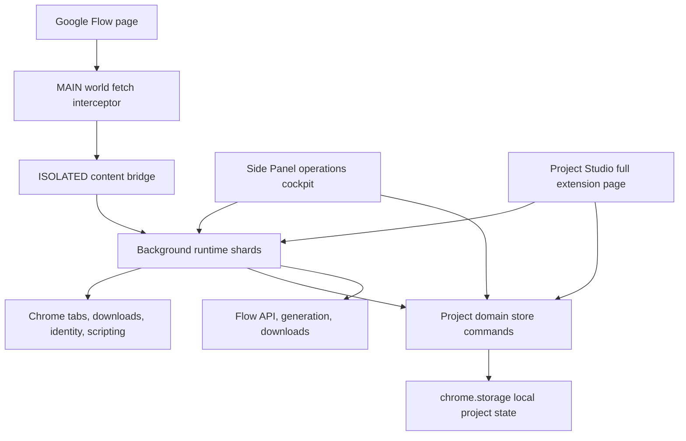
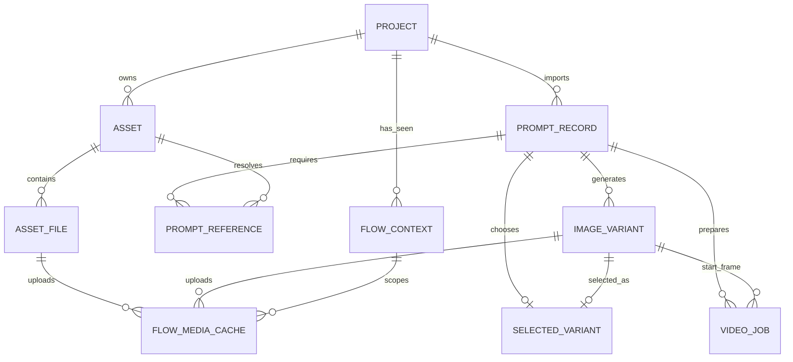
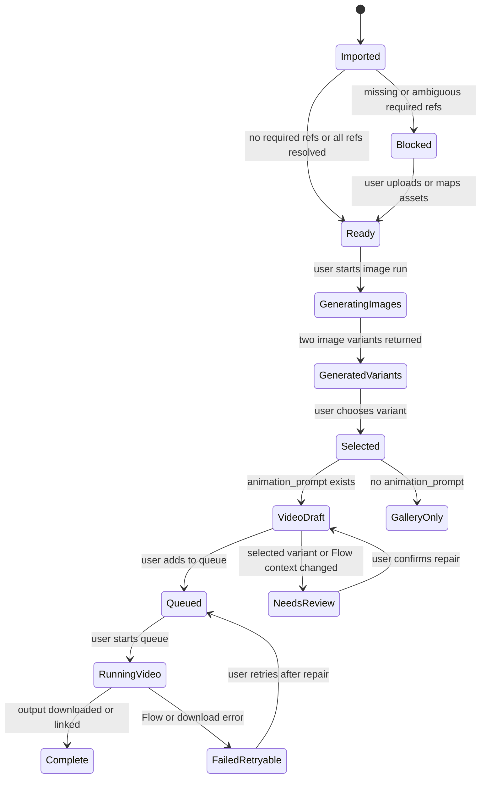

# Architecture Spine - AutoFlow Project Studio Refactor

## Design Paradigm

AutoFlow keeps its existing Chrome MV3 classic-script architecture and adds a project-scoped domain layer. The extension is organized as a layered state machine:

- Extension adapters: manifest, side panel, Project Studio, content scripts, background service worker, Chrome APIs.
- Project domain store: project, asset, prompt, variant, selection, video draft, queue, gallery, and Flow-context records.
- Flow adapters: Google Flow tab detection, reference upload, image generation, video generation, polling, downloads, and cache repair.
- UI state machines: Ready, Blocked, Generating, Generated, Selected, Draft, Queued, Running, Failed, Complete, Needs Review, Stale Context.



## Invariants & Rules

### AD-1 - Project Is The Top-Level Domain Boundary [ADOPTED]

- **Binds:** FR-1, FR-2, FR-20, FR-22, side panel project selector, Project Studio sections, gallery/download recovery, queue summaries.
- **Prevents:** Global one-character or one-channel state leaking across unrelated productions.
- **Rule:** All assets, imported prompts, generated variants, selected mappings, video jobs, queue state, gallery records, and Flow cache entries MUST be scoped to a stable `project_id`; UI reads and actions MUST filter through the active project unless an operation explicitly spans projects.

### AD-2 - Stable IDs Own Identity

- **Binds:** FR-2, FR-6, FR-8, FR-12, FR-14, FR-16, FR-23.
- **Prevents:** Display-name, alias, filename, or upload filename edits breaking imported prompts, selections, video drafts, and recovery paths.
- **Rule:** `project_id`, `asset_id`, `asset_file_id`, `prompt_id`, `variant_id`, `job_id`, and `flow_context_id` are the primary relationship keys; display names, aliases, `file_name`, and physical filenames are mutable labels or expected-output names, never primary identity.

### AD-3 - Project Studio Owns Large Management Work

- **Binds:** FR-3, FR-13, FR-16, FR-19, UX surface map, wireframes.
- **Prevents:** Duplicated UI ownership and cramped image/asset/video workflows inside the narrow side panel.
- **Rule:** Project Studio is the full extension page for project settings, assets, import/resolution, image review, video draft building, and gallery/download inspection; the side panel remains the compact operations cockpit for active project, Flow connection, blockers, queue controls, Sync Folder, Retry Failed, and opening Project Studio.

### AD-4 - Required References Gate Image Generation

- **Binds:** FR-4, FR-5, FR-7, FR-8, FR-9, FR-10, FR-12, NFR-2.
- **Prevents:** Generating images while silently omitting JSON-listed character, place, prop, style, or generic reference assets.
- **Rule:** JSON-listed references are required by default; any prompt with unresolved or ambiguous required references MUST enter `Blocked` state and MUST NOT be eligible for image generation until the user manually uploads or maps the needed project asset files.

### AD-5 - Variant Selection Is Metadata-First

- **Binds:** FR-11, FR-13, FR-14, FR-15, FR-20, FR-21.
- **Prevents:** Destructive immediate renames, lost alternate variants, and inconsistent gallery or video-start-frame mappings.
- **Rule:** Selecting an image variant updates a `prompt_id -> variant_id` canonical selection record; downloaded/exported canonical filenames use that mapping later, while non-selected variants remain retained and traceable.

### AD-6 - Video Generation Is Manual Queue Work

- **Binds:** FR-16, FR-17, FR-18, FR-19, NFR-6.
- **Prevents:** Bad or unreviewed images automatically triggering video generation after image completion.
- **Rule:** Image generation completion MUST NOT enqueue or run video generation; video jobs start as Draft or Ready records created from a selected variant plus `animation_prompt`, and only enter/run the queue after explicit user action.

### AD-7 - Flow Media IDs Are Context-Scoped Caches

- **Binds:** FR-22, FR-23, FR-24, account-switch recovery, Sync Folder, Retry Failed.
- **Prevents:** Reusing stale Google Flow media/upload IDs across accounts or Flow projects.
- **Rule:** Local project metadata and files are source of truth; Flow upload/media identifiers MUST be stored as cache entries keyed by project asset or variant plus `flow_context_id`, and jobs with stale or missing context cache MUST become Needs Reference Upload, Needs Review, or Failed Retryable rather than silently using old IDs.

### AD-8 - Preserve Ordered Classic-Script Loaders [ADOPTED]

- **Binds:** FR-25, FR-26, current `runtime.js`, `index.html`, `sidepanel.css`, `docs/code-map.md`.
- **Prevents:** A bundler, ES module rewrite, or accidental load-order change becoming hidden scope inside this refactor.
- **Rule:** Background, side panel, and Project Studio code MUST use explicit ordered classic-script loaders unless a later architecture changes the runtime model; loader files stay tiny maps, and new shards require updates to the relevant loader plus `docs/code-map.md`.

### AD-9 - Project State Mutates Through One Domain Command Layer

- **Binds:** FR-1 through FR-24, NFR-3, side panel and Project Studio shared state.
- **Prevents:** Scattered `chrome.storage` writes, inconsistent derived readiness, and UI surfaces racing to invent different record shapes.
- **Rule:** Project-domain writes MUST go through named project-store command functions that validate schema, assign IDs, update derived states, and persist records; UI surfaces and background side effects may call those commands, but MUST NOT directly mutate project records ad hoc.

### AD-10 - Preserve Page, Bridge, And Background Boundaries [ADOPTED]

- **Binds:** MV3 content scripts, connection checks, Flow response interception, downloads, generation runtime.
- **Prevents:** Extension APIs leaking into MAIN-world page code, broad fetch interception, duplicated message routers, and brittle Google Flow coupling in UI code.
- **Rule:** `page-fetch-interceptor.js` stays page-world and limited to Flow response observation; `flow-page-bridge.js` stays the isolated bridge; background runtime owns Chrome APIs, Flow API calls, downloads, queue execution, and message routing.

### AD-11 - Legacy Jack Is A Migration Boundary

- **Binds:** FR-8, FR-12, bundled `assets/reference/Jack.jpg`, current prompt-index compatibility.
- **Prevents:** Reintroducing hardcoded Jack as a universal reference inside the project-aware workflow.
- **Rule:** New project-aware imports MUST NOT attach `assets/reference/Jack.jpg` unless the active project or a migration explicitly maps Jack to a normal project Asset; legacy import behavior may remain behind compatibility code until a migration decision is made.

### AD-12 - Project Persistence Uses One Versioned Envelope

- **Binds:** FR-1 through FR-24, schema migration, Sync Folder repair, Project Studio and side panel shared reads.
- **Prevents:** Independent stories creating incompatible `chrome.storage` keys, record envelopes, or migration paths.
- **Rule:** Project-domain records MUST persist under one versioned storage envelope, `autoflowProjectStateV1`, with schema version metadata and migration hooks; implementation stories may add fields inside that envelope but MUST NOT create parallel persistent project stores.

## Consistency Conventions

| Concern | Convention |
| --- | --- |
| Entity IDs | Use stable snake_case fields ending in `_id`; generated IDs are opaque and never derived from display labels or filenames. |
| Entity names | User-visible names are editable display metadata; aliases are resolver inputs and should be normalized separately from stored labels. |
| JSON references | Import may accept raw names, but stored prompt dependencies must resolve to `asset_id` plus unresolved reference diagnostics. |
| File naming | `file_name` remains expected canonical image name; generated variants remain traceable through current `__1` and `__2` handling unless a later story changes normalization. |
| State derivation | Prompt and job readiness are derived from references, selected variant, animation prompt, local media presence, and Flow context cache validity. |
| Errors | Blocked and Needs Review states must include a user-facing reason and the next repair action. |
| Mutations | UI actions call project-store commands; background side effects report outcomes through project-store commands or message-router actions. |
| Shared globals | Shared project-domain scripts attach APIs under `globalThis.TFProjectDomain` and stay DOM-free so extension pages and the service worker can load them. |
| Documentation | Any new shard or ownership move updates `docs/code-map.md` in the same implementation story. |

## Stack

| Name | Version |
| --- | --- |
| AutoFlow/TurboFlow extension manifest | 2.2.21 |
| Chrome Extension platform | Manifest V3 |
| Chrome extension service worker imports | `importScripts()` supported for classic service workers |
| Chrome Side Panel API | Chrome 114+ |
| Chrome content script execution worlds | MAIN and ISOLATED |
| JavaScript | Plain classic browser JavaScript, no module build |
| HTML and CSS | Browser-native extension pages, no component framework |
| Persistence | `chrome.storage` as existing extension storage API |
| Google Flow integration | `https://labs.google/*`, external brittle service with no stable public API version |

## Structural Seed

```text
AutoFlow/
  manifest.json
  src/
    background/
      service-worker.js
      runtime.js
      runtime/
        00-state-connection.js
        01-flow-api.js
        02a-generation-common.js
        02b-image-generation.js
        02c-video-generation.js
        03-downloads-cache.js
        04-message-router.js
    content/
      page-fetch-interceptor.js
      flow-page-bridge.js
    shared/
      project-domain/
        00-project-schema.js
        01-project-store.js
        02-reference-resolver.js
        03-selection-and-jobs.js
    sidepanel/
      index.html
      sidepanel.css
      app/
        existing ordered shards
        project-cockpit shard
    project-studio/
      index.html
      studio.css
      app/
        00-studio-state.js
        01-project-settings.js
        02-assets.js
        03-import-resolve.js
        04-image-review.js
        05-video-queue-builder.js
        06-gallery-downloads.js
        07-studio-boot.js
      styles/
        ordered studio style shards
  assets/
    reference/
      Jack.jpg
  docs/
    code-map.md
```





Deployment and environments remain the existing local unpacked Chrome extension workflow for this refactor. Chrome Web Store packaging, hosted backends, cloud sync, and multi-user infrastructure are outside this spine.

## Capability To Architecture Map

| Capability / Area | Lives in | Governed by |
| --- | --- | --- |
| Project creation, selection, switching | Project domain store, side panel cockpit, Project Studio settings | AD-1, AD-2, AD-3, AD-9 |
| Typed asset library and manual uploads | Project Studio Assets, project domain store, Flow upload adapter | AD-1, AD-2, AD-4, AD-7 |
| Project-aware JSON import and reference resolution | Project Studio Import / Resolve, shared reference resolver | AD-2, AD-4, AD-9, AD-11 |
| Image generation eligibility and two-variant records | Background image runtime, project domain prompt state | AD-4, AD-5, AD-8, AD-10 |
| Image Review and selected canonical mapping | Project Studio Image Review, gallery/download mapping | AD-3, AD-5, AD-9 |
| Video drafts and manual queue | Project Studio Video Queue Builder, side panel queue cockpit, background video runtime | AD-5, AD-6, AD-7, AD-10 |
| Gallery, downloads, Sync Folder, Retry Failed | Existing gallery/download shards plus project-aware domain records | AD-1, AD-5, AD-7, AD-9 |
| Account or Flow project switch recovery | Flow context detector, upload cache, repair UI | AD-7, AD-10 |
| Brownfield loader and docs maintenance | Existing loaders, new Project Studio loaders, `docs/code-map.md` | AD-8, AD-12 |

## Deferred

| Decision | Why It Can Wait |
| --- | --- |
| Exact JSON reference field name: `refs`, `references`, or both | Resolver can normalize multiple names later; MVP stories need one documented accepted input before implementation. |
| Whether selecting a variant auto-creates a Video Draft | Both options preserve AD-6 because queue/run remains manual; decide in UX story before building Video Queue Builder. |
| Legacy Jack migration strategy | AD-11 blocks new hardcoding now; automatic migration can be a focused compatibility story. |
| Asset alias uniqueness across project versus per type | Resolver behavior can support either, but Asset Manager and Import Resolver must decide together before implementation. |
| Advanced video reference modes beyond selected start frame | Google Flow video reference behavior is uncertain; AD-6 and AD-7 keep MVP safe until tested. |
| Optional JSON references | Required-by-default behavior is the MVP safety rule; optional refs can be added without weakening AD-4 if explicit in schema. |
| Full ES module, bundler, or automated test toolchain | This refactor preserves brownfield stability; a later architecture can replace AD-8 if the project intentionally modernizes. |
| Chrome Web Store distribution and hosted/cloud project sync | Current product goal is local unpacked extension workflow, not distribution or multi-user infrastructure. |
